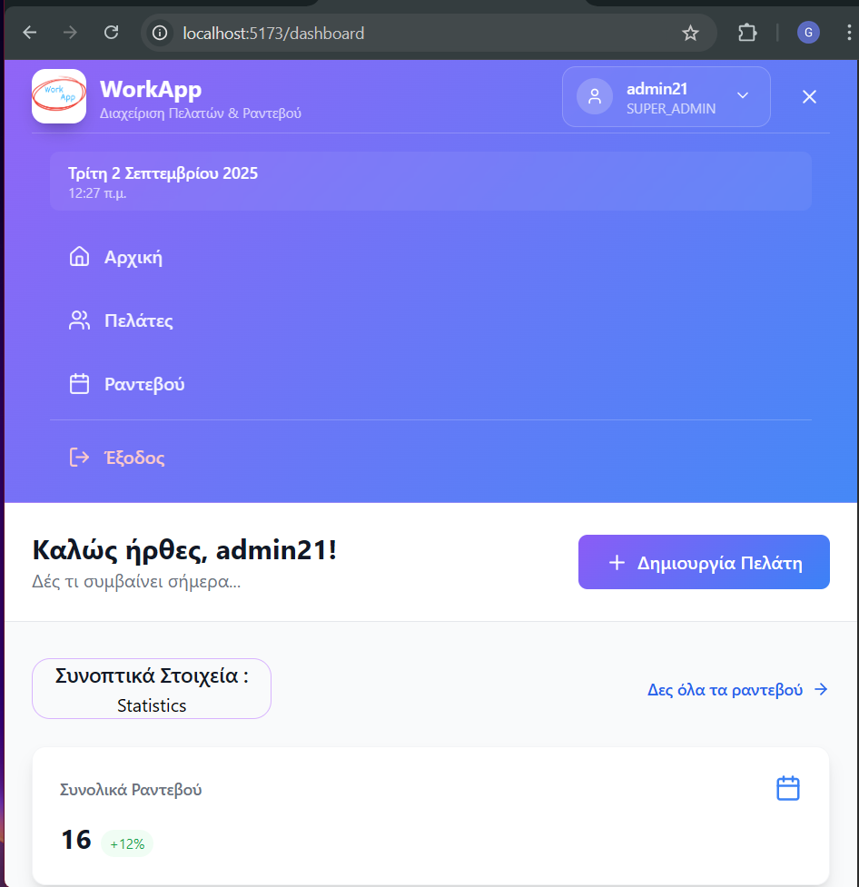

[](https://github.com/grgks/appointment-system-react/releases)


<table border="0" cellpadding="0" cellspacing="0">
<tr>
<td></td>
<td><h3 style="margin: 0; font-weight: bold;"> Appointment/Client Management System Frontend</h3></td>
</tr>
</table>

This project initially started as the **Capstone Project** for [Coding Factory, Athens University of Economics and Business (AUEB)](https://codingfactory.aueb.gr/) and has since evolved into a modern, scalable React-based frontend application for managing client appointments and user administration.  
Built with React 19, TypeScript, and TailwindCSS, it provides a clean interface for appointment scheduling, client management, and administrative tasks.  

The architecture is designed with scalability in mind, allowing for easy extension to new entities and features.  
Upcoming enhancements include **user profile settings**, advanced **email reminder workflows**, and additional administrative tools.

[](https://github.com/grgks/appointment-system-react/releases/tag/v1.0.0)

👉 **Note**: This repository contains only the **frontend** part of the system.  
The corresponding **backend REST API** can be found here:  
[(WorkApp Backend)](https://github.com/grgks/system-management-RestAPI)

## 📸 Screenshots
<table border="0" cellpadding="0" cellspacing="0">
<tr>
<td></td>
<td></td>
<td></td>
<td></td>
<td></td>
<td></td>
</tr>
</table>

### 🎥**Video Demonstration:** [⬇️ WorkApp Easy Schedule QuickView (43.6MB .mp4)](https://github.com/grgks/appointment-system-react/releases/tag/v1.0.0)
available under **Assets** --> **download**

## ⚡ Performance

| Metric | Value | Status |
|--------|-------|---------|
| **Page Load Time** | 230ms | ✅ Excellent |
| **First Contentful Paint** | 230ms | ✅ Excellent |
| **Memory Usage** | 27MB | ✅ Stable |
| **User Interactions** | 64ms | ✅ Responsive |
| **API Response Time** | 25-45ms | ✅ Quick |
| **Database Queries** | 20-30ms | ✅ Efficient |
| **Authentication** | <10ms | ✅ Instant |

**Summary:** All performance metrics within optimal ranges for smooth user experience.

*Measured using Chrome DevTools in development environment*

## Features

### 🏠 Dashboard
- Overview of recent and upcoming appointments
- Quick statistics and key metrics
- Modern responsive design with intuitive navigation
- Real-time data updates

### 👥 Client Management
- Complete client profiles with personal information
- Contact details, notes, and VAT information management
- Advanced search and filtering capabilities
- CRUD operations for client records
- Client-appointment relationship tracking

### 📅 Appointment Management
- Intuitive appointment scheduling interface
- Status tracking (Pending, Confirmed, Completed, Cancelled)
- Email reminder system with status monitoring *(in progress)*
- Date and time management with validation
- Appointment history and notes
- Chronological sorting by proximity

### 👤 User Profile Settings *(planned)*
- Personal information management
- Change password & security settings
- Notification preferences
- Integration with email reminders

### 🔐 Authentication & Security
- JWT token-based authentication
- Role-based access control (CLIENT, PATIENT, SUPER_ADMIN)
- Secure API communication
- Session management

### 📱 Modern UI/UX
- Responsive design for desktop and mobile
- TailwindCSS for consistent styling
- Lucide React icons for modern interface
- Loading states and error handling
- Form validation and user feedback

## Tech Stack

- **Frontend Framework**: React 19.1.0
- **Language**: TypeScript 5.9.2
- **Build Tool**: Vite 7.0.4
- **Styling**: TailwindCSS 4.1.11
- **Routing**: React Router DOM 7.7.1
- **HTTP Client**: Axios 1.11.0
- **Icons**: Lucide React 0.536.0
- **Form Handling**: TailwindCSS Forms

## Prerequisites

- Node.js 18.0 or higher
- npm package manager
- Running backend API (see [Backend Repository](https://github.com/grgks/system-management-RestAPI))
---

⚠️ **Start the backend first!** The frontend won't work without the API running on `http://localhost:8080`

---
## Quick Start

### 1. Clone the Repository
```bash
git clone https://github.com/grgks/appointment-system-react.git
cd appointment-system-react
```
### 2. Install Dependencies
```bash
npm install
```

### 3. Start the Development Server
```bash
npm run dev
```

The application will start on `http://localhost:5173`

### 4. Build for Production
```bash
npm run build
```
## 🧪 Testing & QA

This project includes fully implemented automated tests to ensure reliability and quality.

### Unit & Integration Testing
- Implemented using **Jest** with TypeScript support (`ts-jest`).  
- Covers core components, services, and utility functions.  
- Provides code coverage metrics.

### End-to-End (E2E) Testing
- Implemented using **Jest + Selenium WebDriver** for UI automation.  
- Covers critical user flows such as login, client management, and appointment scheduling.  
- Configured with a generous timeout for long-running scenarios.  

### Test Reporting
- **Allure Reports**: detailed, visual reports in `allure-results` → open via `npm run allure:report`.  
- **HTML Reports**: generated with `jest-html-reporter` for quick viewing.  

### Quick Start for Tests
```bash
# Run unit & integration tests
npm run test

# Run E2E tests
npm run test:e2e

# Clean previous test results
npm run test:clean

# Generate & open Allure report
npm run allure:report
```
## 🧪 Test  Screenshots & Reports 📸
**Jest**⬇️
<table border="0" cellpadding="0" cellspacing="0">
<tr>
<td></td>
</tr>
</table>

**Allure Reports**⬇️
<table border="0" cellpadding="0" cellspacing="0">
<tr>
<td></td>
<td></td>
<td></td>
</tr>
</table>

**E2E Test Reports**⬇️
<table border="0" cellpadding="0" cellspacing="0">
<tr>
<td></td>
<td></td>
</tr>
</table>

⚠️ **Note**: Make sure the backend API is running to execute E2E tests successfully.

## Backend Integration

- **Backend Repository**: [https://github.com/grgks/system-management-RestAPI](https://github.com/grgks/system-management-RestAPI)
- **API Base URL**: `http://localhost:8080`
- **Authentication**: JWT Bearer Token
- **Database**: MySQL 8.0
- **Framework**: Spring Boot 3.4.7

### API Integration Features
- RESTful API communication via Axios
- JWT token management
- Role-based endpoint access
- Comprehensive error handling
- Request/response data transformation

## Project Structure
```
src/
├── components/            # React components organized by feature
│   ├── appointments/      # Appointment-related components
│   ├── calendar/          # Calendar components
│   ├── clients/           # Client management components
│   ├── common/            # Shared components
│   ├── dashboard/         # Dashboard widgets
│   ├── forms/             # Form components
│   ├── layout/            # Layout components (Header, Footer)
│   └── ui/                # Base UI components (Button, Card, etc.)
├── hooks/                 # Custom React hooks
├── pages/                 # Page-level components
├── services/              # API service layer
├── types/                 # TypeScript type definitions
└── utils/                 # Utility functions and constants
```
## Authentication Flow

1. **Registration**: Users register through the client registration endpoint
2. **Login**: Authenticate with username/password to receive JWT token
3. **Token Storage**: JWT token stored securely for API requests
4. **Protected Routes**: Role-based access to different application areas

## Available Scripts

- `npm run dev` - Start development server
- `npm run build` - Build for production
- `npm run preview` - Preview production build

## API Documentation

For complete API documentation, visit the backend Swagger UI at:
[http://localhost:8080/swagger-ui.html](http://localhost:8080/swagger-ui.html) when backend is running


## Development Guidelines

### Code Style
- TypeScript strict mode enabled
- ESLint configuration for code quality
- Consistent component structure and naming
- Custom hooks for business logic separation

### Component Architecture
- Functional components with React hooks
- Props typing with TypeScript interfaces
- Reusable UI components in `/components/ui/`
- Page-level components in `/pages/`

### State Management
- Local state with useState/useReducer
- Custom hooks for shared logic
- Context providers for global state
- No localStorage usage (as per platform restrictions)
---

##  📝Notes: 
> This frontend application requires the backend API to be running. Please refer to the [backend repository](https://github.com/grgks/system-management-RestAPI) for setup instructions.
> 
> ℹ️ The current version focuses on the implementation and presentation of the React application.
> 
>   🔹 Future improvements may include:
> - ✅ Lighthouse reports for automated performance auditing  
> - ✅ Automated UI tests (React Testing Library / Cypress)  
> - ✅ CI/CD pipelines (GitHub Actions)  
> - ✅ Dockerization for a more production-ready deployment  
---

## License

This project is licensed under the MIT License - see the LICENSE file for details.

## Support

For support and questions:
- Create an issue in this repository
- Check the backend API documentation
- Review the Swagger UI for endpoint details

---

🙏 Acknowledgments

- *[Coding Factory AUEB](https://codingfactory.aueb.gr/)* for providing excellent training in modern web development technologies and inspiring this project  as part of my capstone project
- React & TypeScript communities for comprehensive documentation and best practices
- TailwindCSS team for the excellent utility-first CSS framework
- Vite team for the lightning-fast build tool that powers our development
- Lucide React for beautiful, consistent iconography
- All contributors who help improve this appointment management system
- The open source ecosystem that makes modern web development possible

⭐ Support This Project
If you find WorkApp helpful for your appointment management needs, please consider giving it a star! ⭐
Your support helps:

📈 Increase project visibility for others who might benefit
🚀 Motivate continued development and new features
🤝 Build a stronger community around the project
